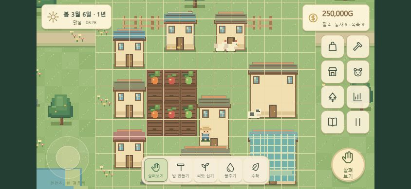

# 검증 기록

검증일: 2026-10-01, Asia/Seoul. Node 24.19.0, npm 11.17.0, Phaser3.90, TypeScript5.9, Vite7.3, Vitest4.1.11.

## 자동 검증

`npm test`는 TypeScript 검사, 프로덕션 빌드, Vitest를 순서대로 실행합니다. 4개 파일의 55개 테스트가 통과했습니다.

- 시작 상태와 집 배치·이동·점유.
- 첫 수확부터 판매·확장까지 전체 규칙.
- 사방 인접, 범위·한도·돈·미납, 집 단계별 가격.
- 신선도 경계, 제철·상인 곱셈, 냉장 속도, 오래된 재료 우선 사용.
- 600초 하루, 월·계절·연도 경계, 메뉴 시간 정지, 비제철 보존, 관개 속도 불변.
- 상대 분야 연구 조건, 운영비와 미납 해제.
- 브리딩 확률·경계·40% 특성 유전·변이·개체 정원·부모자식 기록.
- 가공의 재료 소비·예약·기간·수거, 반복 가공 종료, 축사 자동화·자동 수확.
- 온실 작물 이동, 다중 시설 원자적 이동, 퇴비, 출하·혈통 보존.
- IndexedDB 슬롯, 동시 저장 순서, 스냅샷, migration과 손상·미래 버전 거절.
- 서비스워커 manifest/아이콘/실제 번들 precache, 설치·활성화, 캐시의 오프라인 탐색/자산 응답과 타 출처 제외.
- 900개 농지의 하루 종료와 수확 준비 상태.

오프라인 서비스워커 테스트는 네트워크 실패를 모의한 단위 테스트입니다. 실제 휴대전화 비행기 모드 검사와 동일하지 않습니다. 900칸 테스트는 로직 검증이며 모바일 60FPS를 입증하지 않습니다.

## 실제 브라우저

Codex 내장 Chromium에서 다음을 직접 조작했습니다.

1. 1280×720: 메인 메뉴 → 새 게임 → 집 미리보기/확정.
2. 빈 땅 선택 → 밭 만들기 → 당근 심기 → 물주기 → 무료 보관 상자 배치.
3. 집 → 오늘 마치기 → 2일째 성장 → 첫 수확.
4. 방문상인에서 신선도100%, 제철 당근108G 판매. 보유금450→558G.
5. 인접 토지500G 구매. 보유금58G, 관리 화면의 토지10칸 확인.
6. 새로고침 후 이어하기 슬롯에서 2일째·58G 저장 복원 확인.
7. 844×390: 후반 QA 농장 HUD, 동물 목록과 일괄 수거7→0 확인.
8. 844×390: HUD 주요 버튼의 실제 DOM 크기가48×48 이상임을 확인. 행동 버튼70×70.
9. 브라우저 오류 로그에서 런타임 오류가 없는지 확인.

## 남은 검증

실제 iOS/Android 기기, 멀티터치 하드웨어, 앱 설치 UI, 브라우저 강제 종료 시 마지막 저장, 긴 플레이 세션의 경제 균형은 아직 검증하지 않았습니다. 이 릴리스는 플레이 가능한 초기 구현이며 최종 상용 QA 완료 버전으로 표시하지 않습니다.

## 모바일 QA 화면

아래 화면은 일반 새 게임과 분리된 후반 기능 테스트용 시나리오입니다.

